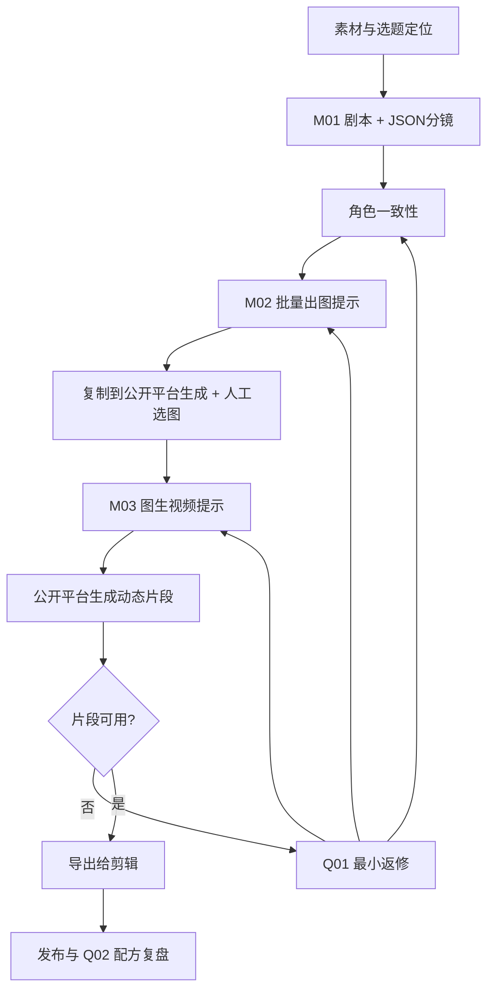

# 两条可复用的闭环工作流

更新：2026-09-28，映序 v1.1。具体按钮操作见 [漫剧使用说明书](04-drama-manual.md) 和 [AI 美女使用说明书](05-beauty-manual.md)。

## 1. 职责边界

工作台负责创作、提示词、素材引用和结果记录；创作者把提示词复制到公开 AI 平台生成媒体，再选片、剪辑和发布。ComfyUI 是可选生成工具，平台 API 无需接入。

顶部按 **AI 漫剧 / AI 美女** 分成两个 Tab，各自显示项目与导航。漫剧按项目、分集和镜头组织；AI 美女按人物和单条作品组织，日常/穿搭/舞蹈是单条作品的玩法。

“只负责提示词”依然需要知道生成结果：工作台可以不调用 ComfyUI，但需要用户将图、视频或结果说明回填到对应镜头。否则只能做到单向交付，无法知道哪条提示词有效。

工作台存在两种提示词：

| 类型 | 使用对象 | 例子 |
|---|---|---|
| 流程指令 | 文本/视觉语言模型 | 把这段小说改成可拍剧本；按时间码拆解这个视频 |
| 生产提示词 | 公开 AI 平台或 ComfyUI 的生成模型 | 角色参考图提示词；这一镜的动作与运镜描述 |

流程指令不会直接粘贴到视频模型中。ComfyUI 的模型参数、参考图槽位也不混进正文假装能生效。

## 2. 共用的底层记录

| 记录 | 最小内容 |
|---|---|
| 项目 | 赛道、画风、画幅、目标时长、提示词语言、受众和模型档案 |
| 来源素材 | 原文件、章节/页格/时间码、来源标识、识别文字、未决信息 |
| 角色 | 稳定身份特征、选定参考图、可复用造型 |
| 场景与道具 | 布局、光线版本、物品外形、可变状态 |
| 镜头 | 剧情目的、来源、角色/场景版本、起点、动作、终点、景别与运镜 |
| 提示词版本 | 模板版本、输入快照、正文、负面提示词（如支持）、模型档案 |
| 生成尝试 | 使用的提示词、实际参考图、实际参数、结果、判定、问题时间点 |
| 配方 | 验证过的配置组合、适用范围、成功样本、已知失败情况 |

资产状态明确区分：**待提供 → 已导入 → 已选定**。“已导入”只说明文件存在，不代表图像合格；写出路径或提示词也不代表已经生成图片。

## 3. AI 漫剧：按批量生产流程组织

工作台不再模拟完整电影剧组。对个人创作者真正有用的主链只有三次 AI 生成：

1. `M01 剧本分镜`：素材、选题、单集剧本、角色草案与 JSON 分镜一次成型。
2. `M02 批量出图`：锁定角色与画风后，生成逐镜静帧提示词。
3. `M03 图生视频`：以选定分镜图为输入，生成短动作提示词和交接说明。

角色一致性、人工选图和结果回填是生产动作，不再伪装成额外的“创作阶段”。

### 3.1 素材接收：保留来龙去脉

小说按章节和段落分段，保留原文位置。长篇先形成章节摘要、人物表和事件索引，再按当前集所需读取原文；不能只用总摘要创作，也不能一次把整部小说塞进有限上下文。

漫画需要额外处理阅读顺序、页码、格子、对白气泡、说话人和画面事实。OCR 负责文字，视觉模型负责画面理解；跨格动作、遮挡、说话人不明之处标记待校对。漫画格子是来源单位，不强制一格等于一个视频镜头。

输出：来源索引、事实表、改编约束、未决项。明确区分“原文事实”“推断”“创作新增”，避免后续把猜测当原著。

### 3.2 创意开发：先管整部，再逐集制作

形成故事设定集：核心冲突、主要人物动机、世界规则、结局方向、伏笔和揭示时点。

形成分集地图：每集覆盖哪些来源、目标、冲突、转折、结尾钩子、人物关系变化。章节数不直接等于集数。指定全剧范围后逐批覆盖全部来源，保存已完成位置；未读取部分保持“未分析”，不能称已完成整部改编。

每集只读取已确认设定、相关来源、前集结束状态和本集目标。后续修改结局或世界规则时，列出受影响集数。

### 3.3 写剧本：变成观众看得见、听得见的内容

每场记录内/外景、地点、时段、在场人物、可见动作、对白/旁白和声音提示。

心理描写需转成表演、事件或旁白。每段对白绑定说话人，不能把配音正文塞进不支持音频的视频模型。声音内容交给用户后期时，单独保存在剪辑备注。

时长是制作预算。先检查台词是否放得下，再决定镜长；默认节奏参数只是试拍起点，不承诺某种镜长必然提高完播率。

### 3.4 剧本拆解与选角：先固定“演员和片场”

拆出角色、造型、场景、道具。角色身份跨集复用，服装/伤势/湿发等作为状态版本。

工作台给出角色定妆、需要的视角、场景和关键道具提示词。由用户在 ComfyUI 出图、挑选，再绑定实际图片。建议从一名主角、一套服装、一个场景开始小样验证；不要在未验证时一次性生成全剧所有资产。

正面、侧面、全身参考按镜头需要生成；三视图不是每个项目的硬门槛。合成参考板是否适合直接输入模型，由具体工作流决定。

### 3.5 分镜与首帧：一个镜头承担明确目的

每镜至少记录：

| 字段 | 用途 |
|---|---|
| 固定镜号 | 例如 `EP001-S003`，重排不改 ID |
| 来源及剧情目的 | 这一镜落实哪条剧本内容 |
| 资产版本 | 哪个角色、服装、场景、道具 |
| 起始状态 | 人物位置、手、视线、持物、门窗等 |
| 主要动作 | 可在目标时间内完成的动作 |
| 结束状态 | 下一镜需要承接的可见结果 |
| 摄影 | 景别、机位、方向、运镜、视觉重心 |
| 时间 | 目标剪辑时长与生成时长分开记录 |
| 声音 | 谁说话、画内/画外、后期处理说明 |

初次试拍优先一镜一个主要动作、一个明确运镜；复杂动作允许拆成多个镜头。首帧描述起点，不能提前把动作结果画进去。

正反打需维护视线和屏幕方向。同一空间换角度时，复用角色/场景约束生成新首帧；**不把“上一镜尾帧传下一镜”作为所有剪辑的硬规则。** 连续动作续拍才考虑使用实际尾帧，而且必须先检查该尾帧是否已经漂移。

### 3.6 视频提示词：按模型能力转换

根据已选首帧写动作、节奏、摄影与结束状态。不随意改演员、衣服、道具和剧本。

只支持单首帧的模型，不提供虚假的“尾帧强控制”。不支持多图输入的工作流，先在生成首帧的环节整合资产，视频阶段只使用最终首帧。负面提示词、音频、首尾帧也只在实际支持时交付。

### 3.7 正式“拍摄”交接单

每镜导出：

1. 可复制的图片/视频提示词，各自标明目标模型和用途。
2. 应挂素材及作用：人物、服装、构图、场景、驱动动作分别说明。
3. 工作流档案和已知参数；未知项留空，不能编造 seed、采样器或节点编号。
4. 预期起止状态、可接受标准及剪辑备注。
5. 镜号、提示词版本和建议输出文件名，供回填时匹配。

只有实际素材齐全、档案已验证时才标“可投产”；其他内容仍能导出，标为“草稿/待挂素材”。

## 4. AI 美女：独立创作卡，三步完成

以成年原创虚拟人物或有相应用途授权的成年人物素材为基础。人物形象、日常穿搭、光线和场景可以长期复用。

页面只有人物库、快速创作、作品与收藏。主链为：

**选人物与玩法 → 生成图片提示词 → 平台生成并回填。**

人物库记录实际参考图及稳定特征；没有图时先写形象词，生成并检查后保存为人物。快速创作左右两栏分别放输入和提示词，下方直接回填结果。角色、想法、服装图和参考视频都服务于当前作品，不要求走剧本、选角或分镜阶段。

基础图片词可本地组合；AI 优化调用配置的文本/视觉模型，或复制完整指令到外部对话平台再粘贴结果。默认中文自然语言，平台特殊能力未提供时不编造参数。

满意图片被采用后即可完成作品。视频是可选延伸：选择已检查图片 → 生成动作词 → 外部平台生成 → 回填视频。图片和视频分别采用，视频版本保留实际起始图片及其来源版本。

修改图片条件会清空待用视频正文，历史保留；更换已采用图片会提醒复核旧视频词。失败结果在同一卡片中返修，收藏模板供下一条作品套用。

### 4.1 日常真人感：最适合首先验证

角色参考 → 生活场景图片词 → 平台出图并采用。需要视频时再增加一个简单动作。

先选回眸、轻微转头、整理衣袖、短距离走动等动作。真人感来自一致的光线、动作重量、眼神、皮肤材质和稳定背景；堆叠“8K、超真实”不能保证效果。

提示词围绕单个动作写清起点、过程和落点。需手部接触道具时单独关注接触是否成立。

### 4.2 穿搭展示：先锁衣服，再让人物动

角色参考 + 服装图/描述 → 穿搭图片词 → 平台出图并检查衣服细节。展示动作是可选后续。

首次优先固定服装的转身、走近、衣袖/包袋展示。每套衣服单独建造型版本；换装视频可用两个已验证镜头交给用户剪辑，不要求生成模型在一个长镜头内完成复杂变装。

关注领口、袖长、颜色、花纹、配饰是否变化。商品展示涉及具体商品时，还要对照实物，不能把生成细节当商品事实。

### 4.3 跳舞：区分自由动作和参考动作复现

| 目标 | 可行链路 | 提示词的职责 |
|---|---|---|
| 大致风格相似的自由舞蹈 | 人物首帧+I2V | 动作方向、幅度、镜头和场景 |
| 跟随某段视频的动作 | 人物图+驱动视频/姿态输入+兼容模型 | 依模型描述外观、背景或补充动作约束 |
| 按音乐精确卡点 | 带明确节拍的驱动片段及支持链路，后期校准 | 文字不能单独承担精确节拍控制 |

使用参考视频时，先分离换镜；记录驱动片段时间范围、主体全身是否可见、遮挡及动作幅度。缺失的身体部位不能靠文字可靠恢复。

初代 Wan-Animate 与 Wan-Animate-2 的输入要求不同，分别维护档案。Animate-2 官方示例使用外观/背景描述，不能强制套用普通 I2V 的长动作叙述。

## 5. “给视频，生成提示词”怎么做

1. 读取视频时长、分辨率、帧率；识别切镜并保留时间码。
2. 按镜头提取关键画面；分析主体、服装、背景、光线、景别、动作和镜头运动。
3. 对快速动作增加采样，保留完整片段用于复核。仅凭稀疏截图，不能声称已还原连续舞步。
4. 每个结论区分观察事实、推断与无法确认项。听不到音轨就不编造节拍；镜头运动不确定就标记。
5. 提炼可复用模板：保留节奏和镜头方法，将人物身份、服装、地点替换成用户资产。
6. 按模型路线输出提示词和素材要求；需要动作复现时同时给出驱动片段选择建议。

这叫参考视频拆解与再创作方案，**不是找回原视频的原始提示词、seed 或模型参数**。

首版可让用户手工指定片段时间并上传关键帧，先跑通流程；自动切镜和视频理解作为后续增强。

## 6. 生成反馈如何真正闭环

每次回填至少包含：对应镜号/版本、实际结果或截图、实际使用的素材、预期、实际、问题时间点。暂时不方便导入视频时允许文字记录，但标记为“用户描述，未检查媒体”。

| 现象 | 优先排查 | 回到哪里 |
|---|---|---|
| 换脸、发型漂移 | 首帧、身份参考是否传入、兼容的身份控制能力 | 角色/首帧 |
| 衣服或道具变化 | 造型版本、首帧、遮挡、动作复杂度 | 资产/首帧 |
| 动作没做完 | 镜长、动作数量、目标模型能力 | 分镜/运动提示词 |
| 舞蹈对不上 | 驱动片段、预处理、模型路线 | 动作驱动输入 |
| 两镜接不上 | 起止状态、镜头方向、实际尾帧漂移 | 相邻分镜 |
| 配置错误、OOM | 节点、模型、尺寸、帧数、运行环境 | 工作流配置；不通过改文案伪装修复 |

修改生成新版本，保留旧版及失败样本。每次尽量只改变一个主要变量，便于判断效果。根因不明确时写假设，不把一次结果当成普遍规律。

上游被修改后，受影响的下游标记“需复核”；未引用该版本的镜头不自动重做。例如替换一套服装，只提示复核使用该服装的镜头。

## 7. 从“制作闭环”走到“发布闭环”

用户选定可用镜头 → 导出镜头包/剪辑备注 → 用户剪辑发布 → 手工回填同口径表现 → 选择下一轮选题、开场和镜头模板。

首版记录作品 ID、关联制作版本、发布时间、统计时间窗、播放、观看时长/完播指标、互动、关注，以及制作耗时和生成次数。平台字段不存在就留空，不伪造统计。

制作指标可以直接计算：

- 首次可用率 = 首次生成即被选用的镜头数 / 已进行首轮生成的镜头数。
- 每个可用镜头的生成次数 = 同范围总生成尝试数 / 已选用镜头数。
- 资产复用率 = 引用了既有已选定资产的镜头数 / 同范围镜头数。

分母为零时显示“暂无数据”。发布指标按相同观察窗口比较；账号阶段、选题、封面和发布时间都会影响结果，不能把一次播放量变化全部归因于提示词。

模板沉淀为“适用于哪些模型/输入/动作”的配方。模板升级不反向覆盖历史作品。

## 8. 发布前的必要准备

原著改编、漫画图片、人物肖像和音乐分别确认相应用途授权；“网上能下载”不等于允许商业改编。AI 内容按发布时抖音创作者后台要求进行标识，保留素材来源和生成记录，不把生成画面包装成真实人物的真实事件。

这些准备放在项目素材登记和最终发布环节，不干扰日常改提示词的操作。
